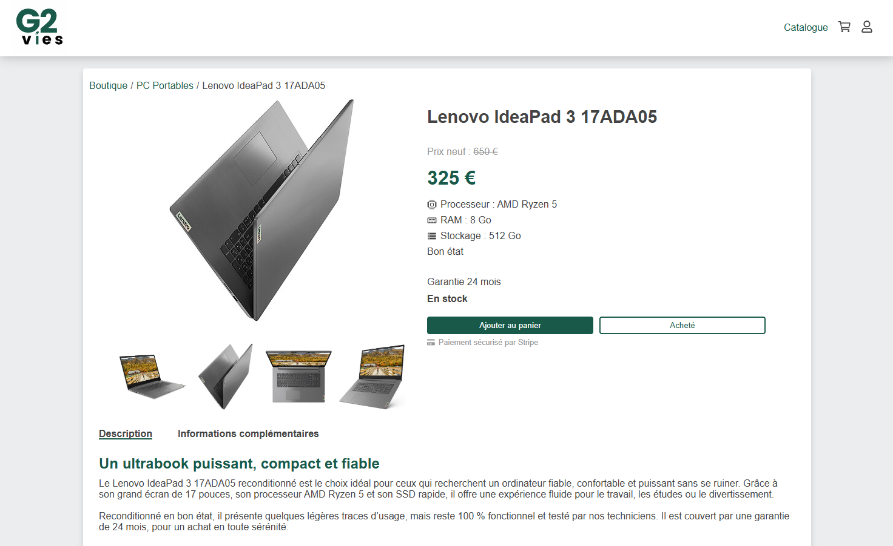

# G2vies - API



**G2vies** est un projet **MERN Stack (MongoDB, Express, React, Node.js)** orienté **plateforme e-commerce / marketplace**.  
Ce repository contient à la fois :

- 📌 Une **API backend** (Express + MongoDB)
- 📌 Une **application frontend React**
- 📌 Authentification, gestion des utilisateurs, produits, panier, catégories, etc.

---

## Table des matières

- [Installation](#installation)
- [Configuration](#configuration)
- [Génération des clés JWT](#génération-des-clés-jwt)
- [Démarrage du serveur](#démarrage-du-serveur)
- [Authentification & Sécurité](#authentification--sécurité)
- [Routes API](#routes-api)
- [Swagger Documentation](#swagger-documentation)
- [Modèles](#modèles)
- [Fonctionnalités](#fonctionnalités)
- [Librairies utilisées](#librairies-utilisées)

---

## Installation

Clonez le projet et installez les dépendances :

### Backend

```bash
git clone https://github.com/Skitch49/g2vies.git
cd g2vies/api
npm install
```

### Frontend

```bash
git clone https://github.com/Skitch49/g2vies.git
cd ../client
npm install
```

---

## Configuration

Créez un fichier `.env` à la racine du dossier `api` :

```env
MONGO_URI=<VOTRE_URI_MONGODB>
PORT=3001
ADMIN_ID=<ID_UTILISATEUR_ADMIN>
```

### Variables d’environnement

- `MONGO_URI` : URI de connexion MongoDB
- `PORT` : port du serveur (par défaut `3001`)
- `ADMIN_ID` : identifiant MongoDB de l’utilisateur administrateur

> ⚠️ Ne partagez jamais votre fichier `.env` publiquement.

---

## Génération des clés JWT

L’API utilise des **tokens JWT signés en RS256**.

Avant de lancer le serveur, générez les clés RSA dans le dossier keys :

```bash
cd api/keys
node generateKeys.js
```

Cela va créer :

- `jwtRS256.key` → clé privée
- `jwtRS256.key.pub` → clé publique

Ces clés sont utilisées pour signer et vérifier les tokens JWT.

---

## Démarrage du serveur

Mode développement avec **nodemon** :

```bash
npm run server
```

API disponible sur :

```
http://localhost:3001/
```

Et Swagger disponible sur

```
http://localhost:3001/api-docs/
```

---

## Authentification & Sécurité

- Authentification via **JWT stocké dans un cookie**
- Middleware `verifyToken` pour protéger les routes utilisateurs
- Middleware `verifyAdmin` pour restreindre certaines routes à l’administrateur

### Middleware `verifyToken`

- Vérifie la validité du token JWT
- Injecte `req.user.id` avec l’ID de l’utilisateur connecté

### Middleware `verifyAdmin`

- Vérifie le token JWT
- Compare l’ID utilisateur avec `ADMIN_ID`
- Refuse l’accès si l’utilisateur n’est pas administrateur

---

## Routes API

### Authentification (`/api/auth`)

| Méthode | Route      | Description                     |
| ------: | ---------- | ------------------------------- |
|    POST | `/`        | Connexion utilisateur           |
|  DELETE | `/`        | Déconnexion utilisateur         |
|     GET | `/current` | Récupère l’utilisateur connecté |

---

### Utilisateurs (`/api/users`)

| Méthode | Route           | Accès       | Description                          |
| ------: | --------------- | ----------- | ------------------------------------ |
|    POST | `/`             | Public      | Création d’un utilisateur            |
|     GET | `/`             | Admin       | Récupère tous les utilisateurs       |
|     GET | `/:id`          | Authentifié | Récupère un utilisateur par ID       |
|   PATCH | `/:id`          | Authentifié | Modification des données utilisateur |
|   PATCH | `/:id/password` | Authentifié | Modification du mot de passe         |

---

### Produits (`/api/products`)

| Méthode | Route                  | Accès  | Description                                   |
| ------: | ---------------------- | ------ | --------------------------------------------- |
|     GET | `/`                    | Public | Liste des produits (pagination & tri)         |
|     GET | `/brandsAndCategories` | Public | Liste des marques et catégories               |
|     GET | `/similarProduct`      | Public | Liste des produits issue de la même catégorie |
|     GET | `/:id`                 | Public | Récupère un produit par ID                    |
|    POST | `/`                    | Admin  | Création d’un produit                         |
|     PUT | `/:id`                 | Admin  | Modification d’un produit                     |
|  DELETE | `/:id`                 | Admin  | Suppression d’un produit                      |

Paramètres disponibles :

```
/api/products?skip=0&limit=10&sortOrder=desc
```

---

### Panier (`/api/cart`)

| Méthode | Route         | Description          |
| ------: | ------------- | -------------------- |
|     GET | `/`           | Récupérer le panier  |
|    POST | `/add`        | Ajouter un produit   |
|   PATCH | `/update`     | Modifier quantité    |
|  DELETE | `/remove/:id` | Supprimer un produit |
|  DELETE | `/clear`      | Vider le panier      |

---

## Swagger Documentation

Documentation interactive disponible à l’adresse :

```
http://localhost:3001/api-docs
```

Permet de :

- Visualiser toutes les routes
- Tester les endpoints
- Consulter les schémas de données

---

## Modèles

### Product

Le modèle `Product` représente un produit vendu sur la plateforme.

#### Champs principaux

- `name` (String, **obligatoire**) — Nom du produit
- `description` (String) — Description du produit
- `price` (Number, **obligatoire**) — Prix de vente
- `originalPrice` (Number, **obligatoire**) — Prix d’origine
- `quantity` (Number, **obligatoire**) — Quantité disponible
- `category` (String, **obligatoire**) — Catégorie du produit
- `brand` (String, **obligatoire**) — Marque
- `condition` (String, **obligatoire**) — État du produit, valeurs possibles :
  - `Neuf`
  - `Comme neuf`
  - `Très bon état`
  - `Bon état`
  - `Usagé`
  - `Reconditionné`

#### Images

- `images` (Array, **obligatoire**) — Tableau d’objets :
  - `url` (String)

> ⚠️ Au moins **une image est requise**.

#### Caractéristiques techniques

- `model` (String)
- `cpu` (String)
- `gpu` (String)
- `ram` (Number)
- `color` (String)
- `weight` (Number)

#### Stockage

- `storage` (Object)
  - `capacity` (Number)
  - `unit` (String) — `Go` ou `To`
  - `type` (String) — `SSD` ou `HDD`

#### Autres spécifications

- `screenSize` (Number)
- `operatingSystem` (String)
- `wifi` (Boolean)
- `webcam` (Boolean)
- `numpad` (Boolean)
- `microphone` (Boolean)
- `bluetooth` (Boolean)

#### Connectique

- `connectors` (Array d’objets)
  - `name` (String)
  - `quantity` (Number)

> Les champs `createdAt` et `updatedAt` sont générés automatiquement.

---

### User

Le modèle `User` représente un utilisateur de la plateforme.

#### Informations utilisateur

- `firstname` (String, **obligatoire**) — Prénom
- `lastname` (String, **obligatoire**) — Nom
- `email` (String, **obligatoire**, unique) — Email de connexion
- `password` (String, **obligatoire**) — Mot de passe chiffré

#### Adresses

Les adresses utilisent un sous-schéma commun.

##### Address

- `country` (String, **obligatoire**)
- `street` (String, **obligatoire**)
- `building` (String)
- `postalCode` (String, **obligatoire**)
- `city` (String, **obligatoire**)
- `phone` (String)

##### Champs liés à l’utilisateur

- `billingAddress` (Address) — Adresse de facturation
- `deliveryAddress` (Address) — Adresse de livraison

#### Paiement

- `stripeCustomerId` (String) — Identifiant client Stripe

> Les champs `createdAt` et `updatedAt` sont générés automatiquement.

---

### Cart

- `user` (ObjectId → User)
- `items` (Array)
  - `product` (ObjectId → Product)
  - `quantity` (Number)

---

## Fonctionnalités

- Authentification sécurisée JWT (RS256)
- Gestion des utilisateurs
- Gestion des produits (CRUD)
- Rôles administrateur
- Support de la pagination et du tri (`skip`, `limit`, `sortOrder`)
- Documentation Swagger pour tester facilement l’API

---

## Librairies utilisées

### Backend (API – Node.js / Express)

- `express` : framework web pour Node.js
- `nodemon` : rechargement automatique du serveur en développement
- `cookie-parser` : gestion des cookies
- `jsonwebtoken` : création et vérification des tokens JWT
- `mongoose` : ODM pour MongoDB
- `bcrypt` : hash des mots de passe
- `dotenv` : gestion des variables d'environnement
- `swagger-ui-express` : documentation interactive Swagger
- `yamljs` : lecture de fichiers YAML pour Swagger
- `cors` : gestion des requêtes cross-origin
- `sass-embedded` : lecture de fichiers scss pour le css

### Frontend (React)

- `react-hook-form` : gestion et validation des formulaires
- `@hookform/resolvers` : intégration des schémas de validation
- `yup` : validation des données côté client
- `react-router-dom` : gestion du routing
- `sass-embedded` : gestion des styles SCSS
- `react-icons` : bibliothèque d’icônes React
- `react-transition-group` : bibliothèque d'animations React
- `swiper` : bibliothèque de carousel

---

## Remarques

- Le projet est en cours de développement
- L'API constitue la base backend du projet **G2vies**
- Les futures évolutions incluront l’extension des règles métiers et des fonctionnalités e-commerce
